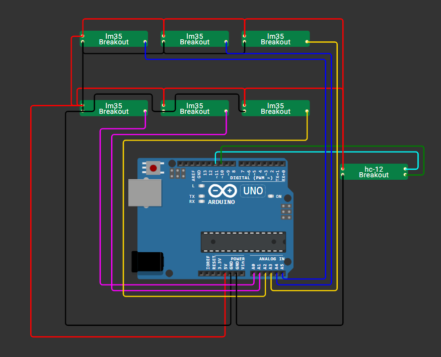
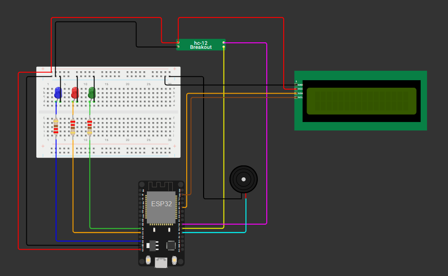
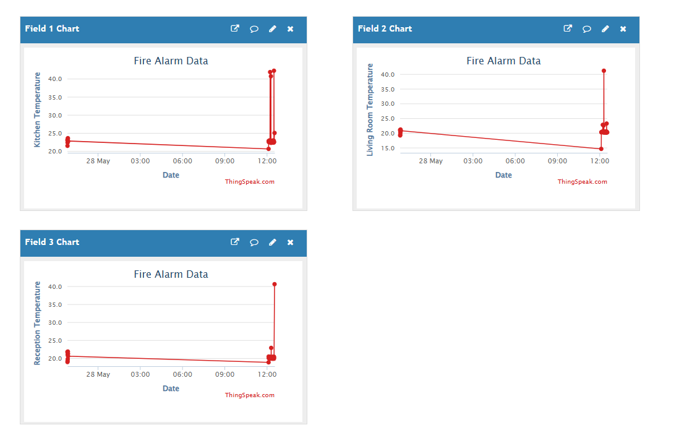

# 🔥 IoT Fire Detection System

An Internet of Things (IoT) based fire detection and alert system using Arduino and ESP8266. This project is designed to detect the presence of fire or high temperature and immediately send a notification via the ESP8266 module to alert users, enabling timely response to potential hazards.
## 📸 Screenshots

  
  

  

## 📁 Repository Contents

- `Arduino_sender.ino` — Code for the Arduino-based fire detection node (sensor side).
- `espcode.ino` — Code for the ESP8266 module to handle alert transmission.
- `arduino_project.png` — Circuit diagram for the Arduino fire sensor setup.
- `esp_circuit.png` — Circuit diagram for the ESP8266 connection.

## 🛠️ Hardware Components

- Arduino Uno
- ESP8266 Wi-Fi Module
- Flame Sensor or Temperature Sensor (LM35)
- Buzzer 
- Breadboard and Jumper Wires
- Resistors 

## 🔌 Circuit Diagrams

- **arduino_project.png**: Shows the wiring between the fire sensor and the Arduino.
- **esp_circuit.png**: Shows how the ESP8266 is powered and connected for data communication.

## 🔧 How It Works

1. The **Arduino** constantly monitors the fire sensor's output.
2. When fire or abnormal heat is detected, it sends a signal to the **ESP8266** module.
3. The **ESP8266** connects to Wi-Fi and sends an alert (e.g., via HTTP, MQTT, or email depending on implementation).
4. Users receive real-time alerts and can respond to the emergency.

## 🚀 Getting Started

1. Connect the hardware according to the diagrams provided.
2. Upload `Arduino_sender.ino` to the Arduino.
3. Upload `espcode.ino` to the ESP8266 using the Arduino IDE.
4. Ensure Wi-Fi credentials and IP addresses (if any) are correctly set in the code.
5. Power the system and test fire detection response.

## 🔐 Note

This project is currently private and under development. It is not intended for production use without proper testing and safety evaluations.

